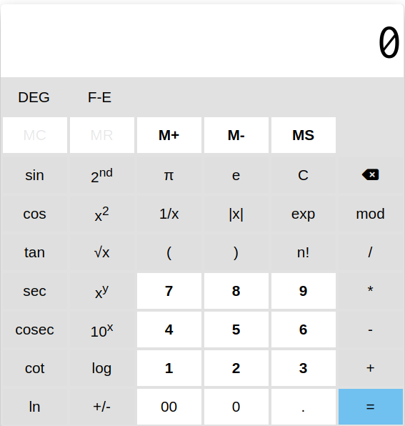

# Practical submission of LMS

## total courses:
> [Git / Version Control](#branch-name-git)
>
> [HTML and CSS](#branch-name-html_css_practical)
>
> [Javascript](#branch-name-js_practical)
>
> [Database](#branch-name-database)

# Branch name: [**git**](https://github.com/pixel-ops/test/tree/git)
- Contains different file and which shows the commits related to the practical
- total file count: 11
- Contains commits: 
    - Pull and Merge difference
    - Rebase
    - Change commit message
    -  cherry pick
    - Drop commit
# Branch name: [**HTML_CSS_practical**](https://github.com/pixel-ops/test/tree/HTML_CSS_practical)
- Clone of flipkart website
- contains static home page of flipkart website
- Revised core concepts of **HTMl and CSS**

## Website Preview :-


## To download the code:

```shell 
mkdir flipkart_website

cd flipkart_website

git clone "https://github.com/pixel-ops/test.git"
```

# Branch name: [**js_practical**](https://github.com/pixel-ops/test/tree/js_practical)
- A web based scientific calculator 
- Clean UI  for better experience
- fast implementation of basic operation of calculator and advanced scientific operations.
- The Scientific calculator consists functions like
    - Addition
    - Substraction 
    - Multiplication 
    - Division
    - Modulo
    - Reciprocal
    - Memory store
    - Memory recall
    - Memory clear
    - Memory +
    - Memory -
    - some advance scientific operations like : 
        - Absolute:   |x|
        - x Square :  x<sup>2</sup>
        - x Square :  x<sup>y</sup>
        - 10 raised to x :  10<sup>x</sup>
        - Logarithm: log(x)
        - Natural Logarithm: ln(x)
        - square root : <span>√x</span>
        - Factorial: n!
        - DEG : x * (π/180)
        - Trignometric Functions


## Calculator Preview :-

<!--  -->
<p align="center"></p>

## New Advanced Functions to be added:
---
>Roots of a given quadratic equation:$$ x = {-b \pm \sqrt{b^2-4ac} \over 2a} $$

>Euler's formula : $$e^{i\pi} + 1 = 0$$

> Integration solution: $$\int_a^b (x + y)^z dx $$

> Differentiation solution: $$\frac{\partial f}{\partial x}$$

>Matrix multiplication : 
> $$
  \left(\begin{array}{cc} 
   a & b\\
   c & d
   \end{array}\right)
   \left(\begin{array}{cc} 
   x & y\\ 
   z & w
   \end{array}\right) = 
   \left(\begin{array}{cc} 
   M & N\\
   O & P
   \end{array}\right)
   $$ 

## To download the code:

```shell 
mkdir Scientific_calculator

cd Scientific_calculator

git clone "https://github.com/pixel-ops/test.git"
```

# Branch name: [**Database**](https://github.com/pixel-ops/test/tree/sql_practical)

- contains pdf file consisting of solution of the queries given in the assignment.
- There are two tables which are

### EmployeeInfo Table:
| EmpID | EmpFname | EmpLname | Department| Project| Address | DOB | Gender |
|:---:|:----:|:---:|:---:|:----:|:---:|:---:|:----:|
|1| Sanjay| Mehra| HR| P1| Hyderabad(HYD)| 01/12/1976| M|
|2 |Ananya |Mishra |Admin |P2 |Delhi(DEL) |02/05/1968 |F |
|3 |Rohan |Diwan |Account |P3 |Mumbai(BOM) |01/01/1980 |M |
|4 |Sonia |Kulkarni |HR |P1 |Hyderabad(HYD) |02/05/1992 |F |
|5 |Ankit |Kapoor |Admin |P2 |Delhi(DEL) |03/07/1994 |M|

### EmployeePosition Table:

| EmpID | EmpPosition | DateOfJoining | Salary |
|:----:|    :---:|      :---:|          :----:|
1 |Manager |01/05/2022 |500000 |
|2 |Executive |02/05/2022 |75000 |
|3 |Manager |01/05/2022 |90000 |
|4 |Lead |02/05/2022 |85000 |
|5 |Executive |01/05/2022 |300000 |

### Queries to executed :-
```
1. Write a query to fetch the number of employees working in the department ‘Admin’

2. Write a query to retrieve the first four characters of  EmpLname from the EmployeeInfo table.


3. Write q query to find all the employees whose salary is between 50000 to 100000.


4. Write a query to find the names of employees that begin with ‘S’


5. Write a query to fetch top N records order by salary. (ex. top 5 records)


6. Write a query to fetch details of all employees excluding the employees with first names, “Sanjay” and “Sonia” from the EmployeeInfo table.


7. Write a query to fetch the department-wise count of employees sorted by department’s count in ascending order.


8. Create indexing for any particular field and show the difference in data fetching before and after indexing

```
### PostgresSQL Queries :-
```sql

1. select count(*) as Admin from public.employeeinfo where department='Admin';


2.SELECT substring(emplname,1,4) "1st 4 characters of first_name" FROM public.employeeinfo


3. select * from employeeposition where salary between 50000 and 100000;


4. select * from employeeinfo where substring(employeeinfo.empfname,1,1) = 'S';


5. select * from employeeposition order by Salary asc limit 3; 


6. select * from employeeinfo where empfname<>'Sanjay' and empfname<>'Sonia';


7. select department,count(department) from employeeinfo group by department order by count(department) asc;


8. create index fname_index on employeeinfo(empfname);
```  

## To download the file:

```shell 
mkdir database

cd database

git clone "https://github.com/pixel-ops/test.git"
```

# Thank you